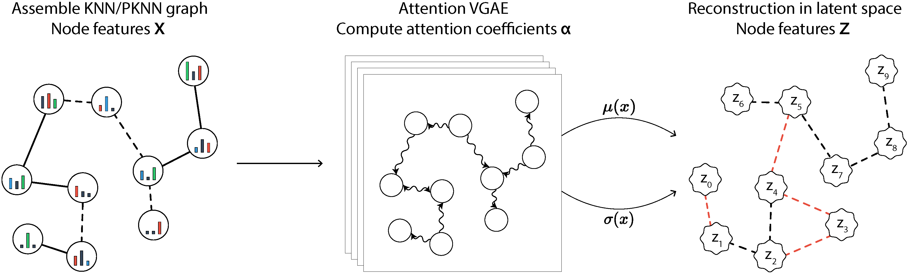

# CellVGAE

An unsupervised scRNA-seq analysis workflow with graph attention networks




CellVGAE uses the connectivity between cells (such as *k*-nearest neighbour graphs or KNN) with gene expression values as node features to learn high-quality cell representations in a lower-dimensional space, with applications in downstream analyses like (density-based) clustering, visualisation, gene set enrichment analysis and others. CellVGAE leverages both the variational graph autoencoder and graph attention networks to offer a powerful and more interpretable machine learning approach. It is implemented in PyTorch using the PyTorch Geometric library.

## Requirements

1. Install the latest version of PyTorch, at the time of writing this is PyTorch 1.9.0 with CUDA 11.1. Instructions are on the [official website](https://pytorch.org/).
2. Install PyTorch Geometric. At the time of writing, the latest version from the master branch must be installed. This is to avoid code that will be deprecated soon, but the official release via Anaconda should soon implement the required changes. Full instructions are at [https://github.com/rusty1s/pytorch_geometric#from-master](https://github.com/rusty1s/pytorch_geometric#from-master) and can be summarised as:
```
pip install torch-scatter -f https://data.pyg.org/whl/torch-1.9.0+cu111.html
pip install torch-sparse -f https://data.pyg.org/whl/torch-1.9.0+cu111.html
pip install git+https://github.com/rusty1s/pytorch_geometric.git
```
3. Install Scanpy (currently at 1.8.1) following the [official instructions](https://scanpy.readthedocs.io/en/stable/installation.html).
4. Install Faiss for CPUs or GPUs from the [official repository](https://github.com/facebookresearch/faiss/blob/main/INSTALL.md). Currently, `faiss-gpu` is implemented for PyTorch 1.7.1 and CUDA 10.2, so if using more recent versions (recommended) it is best to use the CPU version (still extremely fast):
```
conda install -c pytorch faiss-cpu
```
5. Install the following additional packages if not already installed:
```  
pip install seaborn umap-learn hdbscan tqdm scikit-learn pandas termcolor
```  
6. (Optional) For the attention graph visualisations of Figure 6, `igraph` is required:
```
pip install python-igraph
```  
If using the R preprocessing code, we recommend installing the following:

`Seurat 3`, `scran`, `SingleCellExperiment`. `scRNAseq`, `BiocSingular`, `igraph`, `dplyr` and `textshape`.

## Usage

The `train.py` file can be invoked with the arguments detailed below:

```
usage: train [-h] [--input_gene_expression_path INPUT_GENE_EXPRESSION_PATH] [--hvg HVG] [--khvg KHVG] [--graph_type {KNN Scanpy,KNN Faiss,PKNN}] [--k K]
             [--graph_n_pcs GRAPH_N_PCS] [--graph_metric {euclidean,manhattan,cosine}] [--graph_distance_cutoff_num_stds GRAPH_DISTANCE_CUTOFF_NUM_STDS]
             [--save_graph] [--raw_counts] [--faiss_gpu] [--hvg_file_path HVG_FILE_PATH] [--khvg_file_path KHVG_FILE_PATH]
             [--graph_file_path GRAPH_FILE_PATH] [--graph_convolution {GAT,GATv2,GCN}] [--num_hidden_layers {2,3}]
             [--num_heads [NUM_HEADS [NUM_HEADS ...]]] [--hidden_dims [HIDDEN_DIMS [HIDDEN_DIMS ...]]] [--dropout [DROPOUT [DROPOUT ...]]]
             [--latent_dim LATENT_DIM] [--loss {kl,mmd}] [--lr LR] [--epochs EPOCHS] [--val_split VAL_SPLIT] [--test_split TEST_SPLIT] [--transpose_input]
             [--use_linear_decoder] [--decoder_nn_dim1 DECODER_NN_DIM1] [--name NAME] --model_save_path MODEL_SAVE_PATH [--umap] [--hdbscan]

Train CellVGAE.

optional arguments:
  -h, --help            show this help message and exit
  --input_gene_expression_path INPUT_GENE_EXPRESSION_PATH
                        Input gene expression file path.
  --hvg HVG             Number of HVGs.
  --khvg KHVG           Number of KHVGs.
  --graph_type {KNN Scanpy,KNN Faiss,PKNN}
                        Type of graph.
  --k K                 K for KNN or Pearson (PKNN) graph.
  --graph_n_pcs GRAPH_N_PCS
                        Use this many Principal Components for the KNN (only Scanpy).
  --graph_metric {euclidean,manhattan,cosine}
  --graph_distance_cutoff_num_stds GRAPH_DISTANCE_CUTOFF_NUM_STDS
                        Number of standard deviations to add to the mean of distances/correlation values. Can be negative.
  --save_graph          Save the generated graph to the output path specified by --model_save_path.
  --raw_counts          Enable preprocessing recipe for raw counts.
  --faiss_gpu           Use Faiss on the GPU (only for KNN Faiss).
  --hvg_file_path HVG_FILE_PATH
                        HVG file if not using command line options to generate it.
  --khvg_file_path KHVG_FILE_PATH
                        KHVG file if not using command line options to generate it. Can be the same file as --hvg_file_path if HVG = KHVG.
  --graph_file_path GRAPH_FILE_PATH
                        Graph specified as an edge list (one edge per line, nodes separated by whitespace, not comma), if not using command line options
                        to generate it.
  --graph_convolution {GAT,GATv2,GCN}
  --num_hidden_layers {2,3}
                        Number of hidden layers (must be 2 or 3).
  --num_heads [NUM_HEADS [NUM_HEADS ...]]
                        Number of attention heads.
  --hidden_dims [HIDDEN_DIMS [HIDDEN_DIMS ...]]
                        Output dimension for each hidden layer (only 2 or 3 layers allowed).
  --dropout [DROPOUT [DROPOUT ...]]
                        Dropout for each hidden layer (only 2 or 3 layers allowed).
  --latent_dim LATENT_DIM
                        Latent dimension (output dimension for node embeddings).
  --loss {kl,mmd}       Loss function (KL or MMD).
  --lr LR               Learning rate for Adam.
  --epochs EPOCHS       Number of training epochs.
  --val_split VAL_SPLIT
                        Validation split e.g. 0.1.
  --test_split TEST_SPLIT
                        Test split e.g. 0.1.
  --transpose_input     Specify if inputs should be transposed.
  --use_linear_decoder  Turn on a neural network decoder, similar to traditional VAEs.
  --decoder_nn_dim1 DECODER_NN_DIM1
                        First hidden dimenson for the neural network decoder, if specified using --use_linear_decoder.
  --name NAME           Name used for the written output files.
  --model_save_path MODEL_SAVE_PATH
                        Path to save PyTorch model and output files. Will create the entire path if necessary.
  --umap                Compute and save the 2D UMAP embeddings of the output node features.
  --hdbscan             Compute and save different HDBSCAN clusterings.
```
